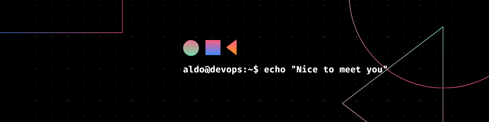

# Hola 👋, soy Aldo García

¡Bienvenido/a a mi perfil! Siéntete libre de explorar como en la terminal de Linux: todo es posible con un buen comando y un poco de curiosidad 🐧.

**DevOps/SysAdmin** con 8 años de experiencia. Apasionado por la infraestructura, automatización, seguridad y desarrollo. Me encanta aprender cosas nuevas, enfrentar desafíos y colaborar en equipo.

---

## 🧰 Stack Tecnológico

<table>
  <tr>
    <td align="center">
       AWS
    </td>
    <td align="center">
       Azure
    </td>
    <td align="center">
       Docker
    </td>
    <td align="center">
       Linux
    </td>
    <td align="center">
       Jenkins
    </td>
    <td align="center">
       Atlassian
    </td>
  </tr>
  <tr>
    <td align="center">
       HTML
    </td>
    <td align="center">
       CSS
    </td>
    <td align="center">
       JavaScript
    </td>
    <td align="center">
       Python
    </td>
    <td align="center">
       Bash
    </td>
    <td align="center">
       Terraform
    </td>
  </tr>
</table>

---

## 🏢 Experiencia

**Hexaware** – DevOps _(actualmente)_  

- Trabajando con **Azure** y **Azure DevOps** automatización, pipelines CI/CD y seguridad.

**Clickit** – DevOps Lead _(Sep 2016 – May 2025)_  

- Diseño de arquitecturas en **AWS**, utilizando más de 20 servicios como: `EC2`, `ECS`, `S3`, `RDS`, `DynamoDB`, `Lambda`, `API Gateway`, `VPC`, `CloudFront`, `IAM`, `CloudWatch`, `CloudTrail`, `CloudFormation`, entre otros.  
- Implementación de pipelines **CI/CD** con `Jenkins`, `GitHub Actions` y `Bitbucket Pipelines`.  
- Automatización de infraestructura como código (**IaC**) utilizando `Terraform`.  
- Optimización de costos en la nube mediante autoescalado, reservas de capacidad y planificación eficiente de recursos.  
- Prácticas **DevSecOps**: escaneos de seguridad (`PCI`) con `Nessus`, integración de `AWS Security Hub` e `Inspector`.  
- Administración de sistemas: servidores con `Nginx`, `MySQL`, `PHP`, correo electrónico, `WordPress` y `Drupal`.  
- Despliegue y soporte para aplicaciones en `Go`, `Python`, `Java`, `JavaScript`, `Ruby`, entre otros lenguajes.  
- Participación en procesos de certificación de `AWS` (Cloud Practitioner y Solutions Architect).  
- Análisis y procesamiento de datos utilizando servicios como `S3`, `Glue` y `Athena`.  
- Gestión de tareas, planificación y seguimiento con **Jira (Atlassian)** y otras herramientas colaborativas.  
- Control de versiones con `GitHub` y `Bitbucket`; documentación técnica en `Confluence`.  
- Gestión de artefactos (`imágenes Docker`, `paquetes binarios`, etc.) con `JFrog Artifactory`.  
- Administración de repositorios de contenedores en `Docker Hub` y `Amazon ECR`.

---

## 🎓 Educación

**Instituto Tecnológico de Saltillo**  
Ingeniero en Sistemas Computacionales

---

## 🏅 Certificaciones

- AWS Certified Solutions Architect  
- AWS Certified Cloud Practitioner  
- Certified Secure Development (a2secure)  
- Certified Cybersecurity & PCI‑DSS (a2secure)

---

## 🌐 Idiomas

- Español (nativo)  
- Inglés (nivel B1)

---

## 📫 Contacto

- 📞 +52 442‑890‑7076  
- ✉️ [garciaaldo843@gmail.com](garciaaldo843@gmail.com)
- 🔗 [LinkedIn](https://www.linkedin.com/in/aldogarcia-devops)  
- 🐙 [GitHub – aldogarcia-devops](https://github.com/aldogarcia-devops)

---

<!-- ## 📊 Estadísticas & Visitas

---

## 🚀 Portafolio & Proyectos Destacados

Aquí algunos de los proyectos en los que he trabajado o contribuido:

- 🔧 **Infraestructura en AWS para e-commerce**  
  Automatización de entornos escalables con Terraform + ECS + RDS  
  🔗 [Repositorio privado | Descripción en LinkedIn o entrevista técnica]

- 🌐 **Sitio web para PyME**  
  Nginx + PHP + MySQL + WordPress + Certbot (SSL)  
  🔗 [https://empresa-ejemplo.com](https://empresa-ejemplo.com)

- ☁️ **Plataforma CI/CD con GitHub Actions + Docker + EKS**  
  Automatización de despliegues para microservicios Go y Node.js  
  🔗 [Repositorio o demo en GitHub Pages]

- 🔍 **Script en Python para análisis en AWS Glue + Athena**  
  Extracción y transformación de grandes volúmenes de datos S3  
  🔗 [https://github.com/garciaaldo/glue-athena-etl](https://github.com/garciaaldo/glue-athena-etl)

---

## ✍️ Blog Técnico

Estoy comenzando a compartir mi experiencia en DevOps, cloud, seguridad y automatización:

- 📘 [¿Qué es Terraform y cómo empezar desde cero?](https://dev.to/tu-blog-o-medium)  
- 🔐 [DevSecOps en AWS: Nessus + Security Hub + Inspector](https://dev.to/tu-blog-o-medium)
- 🛠️ [Cómo diseñar una arquitectura robusta en AWS](https://dev.to/tu-blog-o-medium)

> Puedes seguirme en [Dev.to](https://dev.to/usuario), [Hashnode](https://aldogarcia.hashnode.dev) o [Medium](https://medium.com/@aldogarcia) para más artículos. -->
